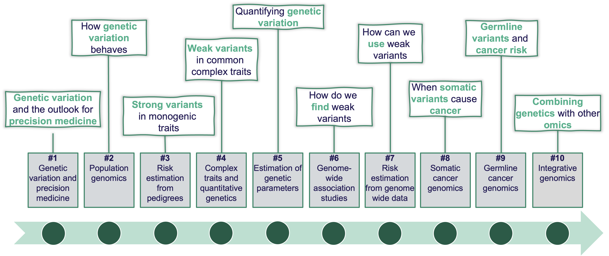

<i>All teaching materials on this page are shared under a CC BY 4.0 license.</i> 

# Course material for the master course in Human Genomics
This page contains the material used within the   course in **Human Genomics** for students studying *Biomedicine* at the master program in Medicine with Industrial Specialisation at Aalborg University, Denmark.

Welcome to the new module, Human Genomics. This module aims to provide you with insight into what shapes the human phenome, and how genetics and genomics can be applied to advance our understanding of human traits, health, and disease, including their application in precision medicine.

Below is a brief overview of the module’s content:

By the end of this module, you will have a comprehensive understanding of human genomics and its transformative role in biology and medicine. This course is designed to equip you with both theoretical knowledge and practical skills, preparing you for further research or careers in genomics-related fields.

The course responsible is Palle Duun Rohde ([Email](mailto:palledr@hst.aau.dk?subject=Subject&body=Text))

## Sessions
**Session 1: Introduction to genetic variation and personalised medicine** \
 [&nbsp; Lecture notes](lecture_notes/01-session_slides-github.pdf)  
 [&nbsp; Exercises](exercises/01-exercises.html)  
 [&nbsp; Intro to R](exercises/01-r-intro.html)  

**Session 2: Population genomics** \
  [&nbsp; Lecture notes](lecture_notes/02-session_slides-github.pdf)  
  [&nbsp; Exercises](exercises/02-exercises.html)   

 <!-- 
 **Session 3: Risk estimation from pedigrees** \
 [&nbsp; Lecture notes](lecture_notes/03-session_slides-github.pdf)  
 [&nbsp; Group work](exercises/JMD006000001.pdf)  
 [&nbsp; Exercises](exercises/03-exercises.html)  
-->

<!--
 **Session 4: Complex traits and quantitative genetics** \
  [&nbsp; Lecture notes](lecture_notes/04-session_slides-github.pdf)  
  [&nbsp; Exercises A](exercises/04a-exercises.html)  
  [&nbsp; Exercises B](exercises/04b-exercises.html)    
  [&nbsp; Exercises C](exercises/04c-exercises.html)    
-->

<!--
 **Session 5: Estimation of genetic parameters** \
  [&nbsp; Lecture notes](lecture_notes/05-session_slides-github.pdf)  
  [&nbsp; Exercises](exercises/05-exercises.html)  
-->

<!--
 **Session 6: Genome-wide association studies** \
  [&nbsp; Lecture notes](lecture_notes/06-session_slides-github.pdf)  
  [&nbsp; Exercises](exercises/06-exercises.html)  
-->
 
 <!--
 **Session 7: Risk estimation from genome-wide data** \
  [&nbsp; Lecture notes](lecture_notes/07-session_slides-github.pdf)  
  [&nbsp; Exercises 1](exercises/PGS-exercise.xlsx)  
  [&nbsp; Exercises 2](exercises/07-exercises.html)  
-->

<!--
 **Session 8: Somatic cancer genomics** \
   [&nbsp; Lecture notes PGS recap](lecture_notes/08-session_slides-PGS-recap_Github.pdf)  
   [&nbsp; Lecture notes](lecture_notes/08-session_slides-github.pdf)  
-->

<!--
 **Session 9: Germline cancer genomics** \
   [&nbsp; Lecture notes](lecture_notes/09-session_slides-github.pdf)  
   [&nbsp; Exercises](exercises/09-exercises.pdf)  
-->

<!--
 **Session 10: Integrative genomics** \
  [&nbsp; Lecture notes](lecture_notes/10-session_slides-github.pdf)
-->

 

