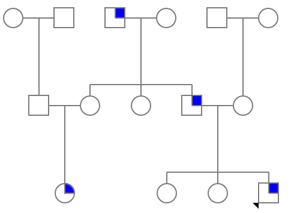

```{r setup, include=FALSE}
knitr::opts_chunk$set(echo = TRUE)
knitr::opts_knit$set(root.dir = "/Users/fs61oo/Documents/GitHub/AAU-human-genomics/")
library(kableExtra)
```

### Exercise 1 (central dogma)
Using the figure below, explain the central dogma of molecular biology and complete the empty boxes.

<p align="center">

</p>
<br />
<br />

### Exercise 2 (genetic terminology)
Below you see two homologous chromosomes (in the metaphase).

<p align="center">

</p>

  1.	What is the definition of a locus?
  2.	How many loci are depicted in the figure?
  3.	What are the genotypes at each locus when the possible alleles in the gene pool are <tt>{A, a, B}</tt>?
  4.	What is a haplotype, and what haplotypes can be identified from the figure?
<br />
<br />

### Exercise 3 (Mendelian genetics) 
In mice, coat color is controlled by the A locus, where the dominant allele <tt>A</tt> results in a brown coat, while the recessive allele <tt>a</tt> leads to a white coat when inherited in a homozygous state (<tt>aa</tt>). Tail length is determined by the <tt>B</tt> locus, with the dominant allele <tt>B</tt> producing normal tail length, whereas individuals with the homozygous recessive genotype (<tt>bb</tt>) have short tails.

  1.  What are the expected genotype and phenotype frequencies in the offspring of a cross between two mice that are heterozygous for both traits?
<br />
<br />

### Exercise 4 (non-disjunction during meiosis) 
The diagram below illustrates the normal segregation of chromosomes during meiosis.

<p align="center">

</p>

Using a similar approach, draw representations of:

  1.  Nondisjunction occurring in Meiosis I.
  2.  Nondisjunction occurring in Meiosis II.
<br />
<br />

### Exercise 5 (non-disjunction during) 
Which of the following scenarios could lead to the formation of a zygote with the karyotype <tt>47, XYY</tt>? Support your answer with an appropriate sketch.
	
1.	Nondisjunction during paternal meiosis I.
2.	Nondisjunction during paternal meiosis II.
3.	Nondisjunction during maternal meiosis I.
4.	Nondisjunction during maternal meiosis II.
5.	Nondisjunction occurring in both paternal meiosis I and maternal meiosis I.
6.	Nondisjunction occurring in either paternal meiosis II or maternal meiosis II.
7.	An error during the first cell divisions following zygote formation.
<br />
<br />	
	
### Exercise 6 (monogenic inheritance pattern) 
The pedigree below illustrates a family affected by acute intermittent porphyria (AIP), a rare metabolic disorder that is characterized by deficiency of the enzyme hydroxymethylbilane synthase (HMBS), also known as porphobilinogen deaminase (PBGD), that results in the accumulation of porphyrins in the body. This buildup occurs due to a deficiency in enzymes involved in the production of heme, the oxygen-carrying molecule in red blood cells. AIP is characterized by episodes of severe abdominal pain, neurological symptoms, and other complications, which can be triggered by factors such as certain medications, stress, or fasting
<br />
<br />

<p align="center">

</p>	
<br />

1.	Add remaining (_correct_) nomenclature to the pedigree.
2.  What mode of inheritance best fits the disease pattern seen in this family? Justify your answer.
    a.  Autosomal dominant with full penetrance.
    b.  Autosomal dominant with incomplete penetrance.
    c.  Autosomal recessive with full penetrance.
    d.  Autosomal recessive with incomplete penetrance.
    e.  X-linked dominant.
    f.  X-linked recessive.
<br />
<br />	
	
### Exercise 7 (pedigree) 
A 25-year-old healthy woman seeks genetic counseling regarding a hereditary skin condition, ichthyosis, which causes dry, thickened _fish-scale_ skin. She provides the following family history:

-  She has a healthy younger brother and sister.
-  Her father has the condition.
-  Her father has an older brother who also has the disease, along with two healthy older sisters.
-  Her father’s brother has three healthy children: a 26-year-old son and two monozygotic 22-year-old daughters.
-  Her mother has a younger brother who has mental retardation but does not have the skin condition.
-  Both of her parents’ families are deceased and were not affected by the disease.
-  Her paternal grandmother has a brother who also has the disease.

Based on the family history:

1.  Draw the pedigree for the family.
2.  What mode of inheritance does this disease have, and why?
3.  The woman stars a relationship with her father's brother's son. If they decide to have a child, what is the risk that their child would inherit ichthyosis?´
<br />
<br />	

### Exercise 8 (genetic terminology) 
Define each of the following genetic terms.

1.  Allele heterogeneity.
2.  Locus heterogeneity.
3.  Incomplete penetrance.
4.  Variable expressivity.
5.  Co-dominance.
6.  Compound heterozygote.
7.  Balanced translocation.
<br />
<br />	

### Exercise 9 (effects of genetic variants) 
For each mutation listed in the left column of the table, analyze its potential impact on both mRNA and protein levels. Then, complete the table by selecting the appropriate option (yes, no, probably, or probably not).

<!---
Table generated with: https://www.tablesgenerator.com/html_tables
-->
<style type="text/css">
.tg  {border-collapse:collapse;border-spacing:0;}
.tg td{border-color:black;border-style:solid;border-width:1px;font-family:Arial, sans-serif;font-size:14px;
  overflow:hidden;padding:10px 5px;word-break:normal;}
.tg th{border-color:black;border-style:solid;border-width:1px;font-family:Arial, sans-serif;font-size:14px;
  font-weight:normal;overflow:hidden;padding:10px 5px;word-break:normal;}
.tg .tg-1wig{font-weight:bold;text-align:left;vertical-align:top}
.tg .tg-0lax{text-align:left;vertical-align:top}
.tg .tg-amwm{font-weight:bold;text-align:center;vertical-align:top}
</style>
<table class="tg"><thead>
  <tr>
    <th class="tg-0lax"></th>
    <th class="tg-amwm" colspan="3">Effect on mRNA</th>
    <th class="tg-amwm" colspan="3">Effect on protein</th>
  </tr></thead>
<tbody>
  <tr>
    <td class="tg-0lax"></td>
    <td class="tg-1wig">Sequence</td>
    <td class="tg-1wig">Length</td>
    <td class="tg-1wig">Amount</td>
    <td class="tg-1wig">Sequence</td>
    <td class="tg-1wig">Length</td>
    <td class="tg-1wig">Amount</td>
  </tr>
  <tr>
    <td class="tg-1wig">Missense variant</td>
    <td class="tg-0lax"></td>
    <td class="tg-0lax"></td>
    <td class="tg-0lax"></td>
    <td class="tg-0lax"></td>
    <td class="tg-0lax"></td>
    <td class="tg-0lax"></td>
  </tr>
  <tr>
    <td class="tg-1wig">Nonsense mutation</td>
    <td class="tg-0lax"></td>
    <td class="tg-0lax"></td>
    <td class="tg-0lax"></td>
    <td class="tg-0lax"></td>
    <td class="tg-0lax"></td>
    <td class="tg-0lax"></td>
  </tr>
  <tr>
    <td class="tg-1wig">3bp deletion in exon</td>
    <td class="tg-0lax"></td>
    <td class="tg-0lax"></td>
    <td class="tg-0lax"></td>
    <td class="tg-0lax"></td>
    <td class="tg-0lax"></td>
    <td class="tg-0lax"></td>
  </tr>
  <tr>
    <td class="tg-1wig">2bp deletion in exon</td>
    <td class="tg-0lax"></td>
    <td class="tg-0lax"></td>
    <td class="tg-0lax"></td>
    <td class="tg-0lax"></td>
    <td class="tg-0lax"></td>
    <td class="tg-0lax"></td>
  </tr>
  <tr>
    <td class="tg-1wig">Splice-site mutation</td>
    <td class="tg-0lax"></td>
    <td class="tg-0lax"></td>
    <td class="tg-0lax"></td>
    <td class="tg-0lax"></td>
    <td class="tg-0lax"></td>
    <td class="tg-0lax"></td>
  </tr>
  <tr>
    <td class="tg-1wig">Silent mutation</td>
    <td class="tg-0lax"></td>
    <td class="tg-0lax"></td>
    <td class="tg-0lax"></td>
    <td class="tg-0lax"></td>
    <td class="tg-0lax"></td>
    <td class="tg-0lax"></td>
  </tr>
  <tr>
    <td class="tg-1wig">Intronic variant</td>
    <td class="tg-0lax"></td>
    <td class="tg-0lax"></td>
    <td class="tg-0lax"></td>
    <td class="tg-0lax"></td>
    <td class="tg-0lax"></td>
    <td class="tg-0lax"></td>
  </tr>
</tbody></table>
<br />
<br />	

    
    
    
    
    
    
    
    
    
    
    