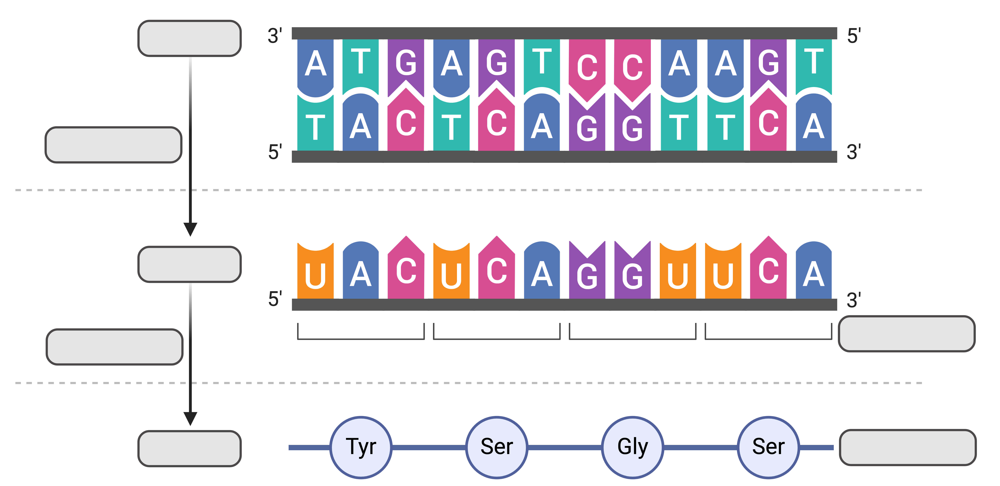
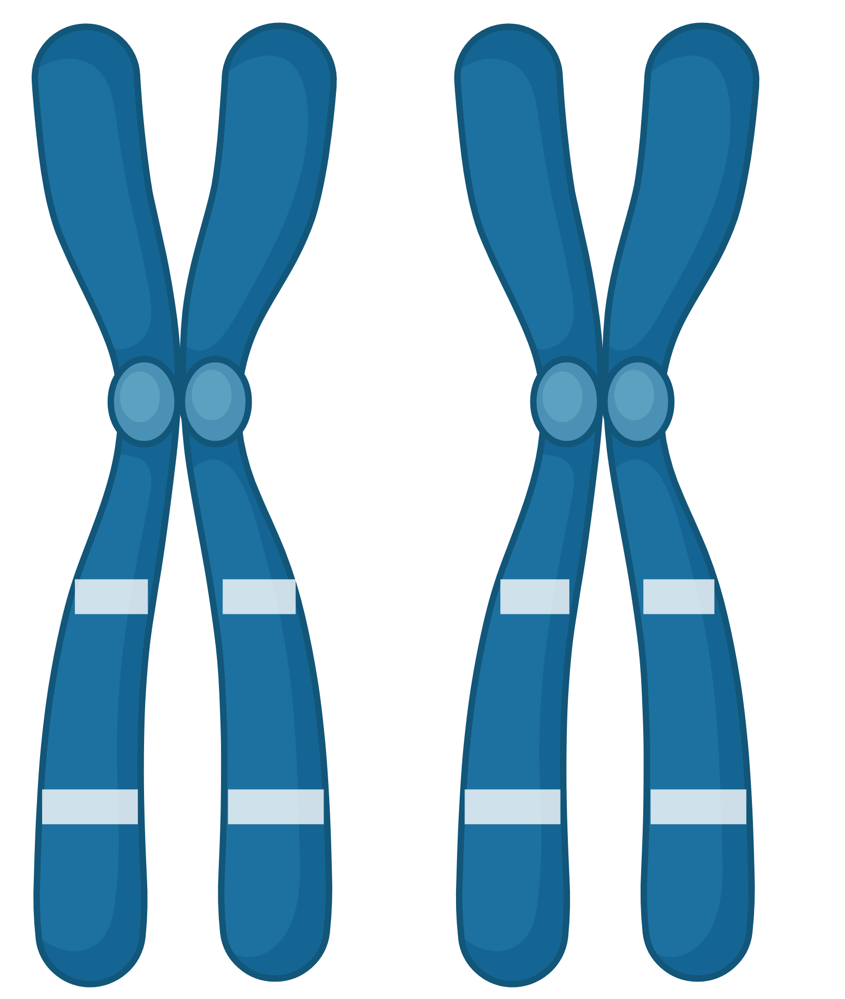

```{r setup, include=FALSE}
knitr::opts_chunk$set(echo = TRUE)
knitr::opts_knit$set(root.dir = "/Users/fs61oo/Documents/GitHub/AAU-human-genomics/")
```

### Exercise 1 (central dogma)
Using the figure below, explain the central dogma of molecular biology and complete the empty boxes.

<p align="center">

</p>

### Exercise 2 (genetic terminology)
Below you see two homologous chromosomes (in the metaphase).

<p align="center">

</p>

1.	What is the definition of a locus?
2.	How many loci are depicted in the figure?
3.	What are the genotypes at each locus when the possible alleles in the gene pool are <tt>{A, a, B}</tt>?
4.	What is a haplotype, and what haplotypes can be identified from the figure?