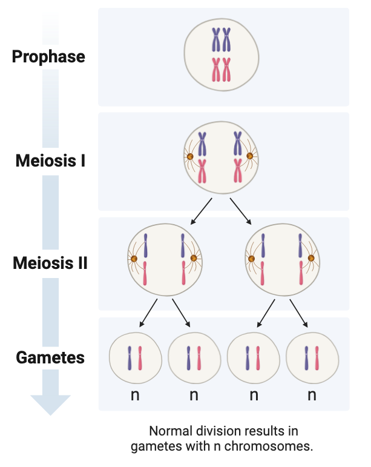

```{r setup, include=FALSE}
knitr::opts_chunk$set(echo = TRUE)
knitr::opts_knit$set(root.dir = "/Users/fs61oo/Documents/GitHub/AAU-human-genomics/")
library(kableExtra)
```

#### Exercise 1 (central dogma)
Using the figure below, explain the central dogma of molecular biology and complete the empty boxes.

<p align="center">

</p>
<br />
<br />

#### Exercise 2 (genetic terminology)
Below you see two homologous chromosomes (in the metaphase).

<p align="center">

</p>

  1.	What is the definition of a locus?
  2.	How many loci are depicted in the figure?
  3.	What are the genotypes at each locus when the possible alleles in the gene pool are <tt>{A, a, B}</tt>?
  4.	What is a haplotype, and what haplotypes can be identified from the figure?
<br />
<br />

#### Exercise 3 (Mendelian genetics) 
In mice, coat color is controlled by the A locus, where the dominant allele <tt>A</tt> results in a brown coat, while the recessive allele <tt>a</tt> leads to a white coat when inherited in a homozygous state (<tt>aa</tt>). Tail length is determined by the <tt>B</tt> locus, with the dominant allele <tt>B</tt> producing normal tail length, whereas individuals with the homozygous recessive genotype (<tt>bb</tt>) have short tails.

  1.  What are the expected genotype and phenotype frequencies in the offspring of a cross between two mice that are heterozygous for both traits?
<br />
<br />

#### Exercise 4 (non-disjunction during meiosis) 
The diagram below illustrates the normal segregation of chromosomes during meiosis.

<p align="center">

</p>

Using a similar approach, draw representations of:

  1.  Nondisjunction occurring in Meiosis I.
  2.  Nondisjunction occurring in Meiosis II.
<br />
<br />

#### Exercise 5 (non-disjunction during) 
Which of the following scenarios could lead to the formation of a zygote with the karyotype <tt>47, XYY</tt>? Support your answer with an appropriate sketch.
	
1.	Nondisjunction during paternal meiosis I.
2.	Nondisjunction during paternal meiosis II.
3.	Nondisjunction during maternal meiosis I.
4.	Nondisjunction during maternal meiosis II.
5.	Nondisjunction occurring in both paternal meiosis I and maternal meiosis I.
6.	Nondisjunction occurring in either paternal meiosis II or maternal meiosis II.
7.	An error during the first cell divisions following zygote formation.
<br />
<br />	
	
#### Exercise 6 (monogenic inheritance pattern) 
The pedigree below illustrates a family affected by acute intermittent porphyria (AIP), a rare metabolic disorder that is characterized by deficiency of the enzyme hydroxymethylbilane synthase (HMBS), also known as porphobilinogen deaminase (PBGD), that results in the accumulation of porphyrins in the body. This buildup occurs due to a deficiency in enzymes involved in the production of heme, the oxygen-carrying molecule in red blood cells. AIP is characterized by episodes of severe abdominal pain, neurological symptoms, and other complications, which can be triggered by factors such as certain medications, stress, or fasting
<br />
<br />

<p align="center">

</p>	
<br />

1.	Add remaining (_correct_) nomenclature to the pedigree.
2.  What mode of inheritance best fits the disease pattern seen in this family? Justify your answer.
    a.  Autosomal dominant with full penetrance.
    b.  Autosomal dominant with incomplete penetrance.
    c.  Autosomal recessive with full penetrance.
    d.  Autosomal recessive with incomplete penetrance.
    e.  X-linked dominant.
    f.  X-linked recessive.
<br />
<br />	
	
#### Exercise 7 (pedigree) 
A 25-year-old healthy woman seeks genetic counseling regarding a hereditary skin condition, ichthyosis, which causes dry, thickened _fish-scale_ skin. She provides the following family history:

-  She has a healthy younger brother and sister.
-  Her father has the condition.
-  Her father has an older brother who also has the disease, along with two healthy older sisters.
-  Her father’s brother has three healthy children: a 26-year-old son and two monozygotic 22-year-old daughters.
-  Her mother has a younger brother who has mental retardation but does not have the skin condition.
-  Both of her parents’ families are deceased and were not affected by the disease.
-  Her paternal grandmother has a brother who also has the disease.

Based on the family history:

1.  Draw the pedigree for the family.
2.  What mode of inheritance does this disease have, and why?
3.  The woman stars a relationship with her father's brother's son. If they decide to have a child, what is the risk that their child would inherit ichthyosis?´
<br />
<br />	

#### Exercise 8 (genetic terminology) 
Define each of the following genetic terms.

1.  Allele heterogeneity.
2.  Locus heterogeneity.
3.  Incomplete penetrance.
4.  Variable expressivity.
5.  Co-dominance.
6.  Compound heterozygote.
7.  Balanced translocation.
<br />
<br />	

#### Exercise 8 (effects of genetic variants) 
For each mutation listed in the left column of the table, analyze its potential impact on both mRNA and protein levels. Then, complete the table by selecting the appropriate option (yes, no, probably, or probably not).

<!---
Table generated with: https://www.tablesgenerator.com/html_tables
-->
<style type="text/css">
.tg  {border-collapse:collapse;border-spacing:0;}
.tg td{border-color:black;border-style:solid;border-width:1px;font-family:Arial, sans-serif;font-size:14px;
  overflow:hidden;padding:10px 5px;word-break:normal;}
.tg th{border-color:black;border-style:solid;border-width:1px;font-family:Arial, sans-serif;font-size:14px;
  font-weight:normal;overflow:hidden;padding:10px 5px;word-break:normal;}
.tg .tg-1wig{font-weight:bold;text-align:left;vertical-align:top}
.tg .tg-0lax{text-align:left;vertical-align:top}
.tg .tg-amwm{font-weight:bold;text-align:center;vertical-align:top}
</style>
<table class="tg"><thead>
  <tr>
    <th class="tg-0lax"></th>
    <th class="tg-amwm" colspan="3">Effect on mRNA</th>
    <th class="tg-amwm" colspan="3">Effect on protein</th>
  </tr></thead>
<tbody>
  <tr>
    <td class="tg-0lax"></td>
    <td class="tg-1wig">Sequence</td>
    <td class="tg-1wig">Length</td>
    <td class="tg-1wig">Amount</td>
    <td class="tg-1wig">Sequence</td>
    <td class="tg-1wig">Length</td>
    <td class="tg-1wig">Amount</td>
  </tr>
  <tr>
    <td class="tg-1wig">Missense variant</td>
    <td class="tg-0lax"></td>
    <td class="tg-0lax"></td>
    <td class="tg-0lax"></td>
    <td class="tg-0lax"></td>
    <td class="tg-0lax"></td>
    <td class="tg-0lax"></td>
  </tr>
  <tr>
    <td class="tg-1wig">Nonsense mutation</td>
    <td class="tg-0lax"></td>
    <td class="tg-0lax"></td>
    <td class="tg-0lax"></td>
    <td class="tg-0lax"></td>
    <td class="tg-0lax"></td>
    <td class="tg-0lax"></td>
  </tr>
  <tr>
    <td class="tg-1wig">3bp deletion in exon</td>
    <td class="tg-0lax"></td>
    <td class="tg-0lax"></td>
    <td class="tg-0lax"></td>
    <td class="tg-0lax"></td>
    <td class="tg-0lax"></td>
    <td class="tg-0lax"></td>
  </tr>
  <tr>
    <td class="tg-1wig">2bp deletion in exon</td>
    <td class="tg-0lax"></td>
    <td class="tg-0lax"></td>
    <td class="tg-0lax"></td>
    <td class="tg-0lax"></td>
    <td class="tg-0lax"></td>
    <td class="tg-0lax"></td>
  </tr>
  <tr>
    <td class="tg-1wig">Splice-site mutation</td>
    <td class="tg-0lax"></td>
    <td class="tg-0lax"></td>
    <td class="tg-0lax"></td>
    <td class="tg-0lax"></td>
    <td class="tg-0lax"></td>
    <td class="tg-0lax"></td>
  </tr>
  <tr>
    <td class="tg-1wig">Silent mutation</td>
    <td class="tg-0lax"></td>
    <td class="tg-0lax"></td>
    <td class="tg-0lax"></td>
    <td class="tg-0lax"></td>
    <td class="tg-0lax"></td>
    <td class="tg-0lax"></td>
  </tr>
  <tr>
    <td class="tg-1wig">Intronic variant</td>
    <td class="tg-0lax"></td>
    <td class="tg-0lax"></td>
    <td class="tg-0lax"></td>
    <td class="tg-0lax"></td>
    <td class="tg-0lax"></td>
    <td class="tg-0lax"></td>
  </tr>
</tbody></table>
<br />
<br />	

#### Exercise 9 (R introduction) 
This section provides a brief introduction to fundamental <tt>R</tt> operations. Follow each step carefully, and ensure you understand what each command does and why it works as expected.

##### Calculations
You can use <tt>R</tt> as a powerful calculator to perform standard arithmetic operations using the following mathematical operators:
```{r}
1 + 3   # Addition
9 - 3   # Subtraction
4 * 9   # Multiplication
20 / 5  # Division
```

<tt>R</tt> follows the conventional mathematical order of operations:

-  Parentheses,
-  Exponents,
-  Multiplication/Division,
-  Addition/Subtraction.
	
```{r}
4 / 2^2 + 2 * 2
```

Explanation:

-	The exponent is calculated first: `2^2 = 4`.
-	Then, division and multiplication are performed from left to right: `4 / 4 = 1` and `2 * 2 = 4`.
-	Finally, addition: `1 + 4 = 5`.

Thus, the result of the expression is `5`.

You can modify the default calculation order by using parentheses to explicitly define how the operations should be performed:

```{r}
(((4/2)^2)+2)*2
```

Breakdown of the calculation:

-	 `4 / 2 = 2` ,
-	 `2^2 = 4` ,
-	 `4 + 2 = 6` ,
-	 `6 * 2 = 12` .
	
##### Assigning objects to variables

In <tt>R</tt>, an object is a fundamental data structure that consists of two key components: **data** (the actual values stored) and a **name** (an identifier used to reference the data). Essentially, objects allow you to store, manipulate, and retrieve data efficiently within your <tt>R</tt> environment.

For example, you can create an object that holds the numbers from 1 to 5 and assign it a name for easy reference:
```{r}
my_numbers <- c(1, 2, 3, 4, 5)
```


In this example:

-  `my_numbers` is the **name** of the object.
- ` c(1, 2, 3, 4, 5)` is the **data**, representing a sequence of numbers.

Once the object is created, you can reference it by its name to access or manipulate the stored data:
```{r}
print(my_numbers)  # Outputs: 1 2 3 4 5
```

To create an object in In <tt>R</tt>, you use the **assignment operator** `<-` (_preferred_) or `=` to assign values to a named variable. For example:
```{r}
x <- 10  # Assigns the value 10 to the object named 'x'
y = 20   # Assigns the value 20 to the object named 'y' (alternative syntax)
```

The arrow (`<-`) is generally preferred for several reasons related to readability, convention, and potential confusion with function arguments.

1.  **Readability and Clarity**
    -  The arrow (`<-`) visually indicates the flow of data from right to left, making it clear that a value is being assigned to an object.  
2.  **Consistency with R Language Conventions**
    -  The arrow (`<-`) is the standard assignment operator in <tt>R</tt> and is used consistently in official documentation, tutorials, and best practices.
    -  Experienced <tt>R</tt> programmers and packages predominantly use `<-`, making it the conventional and expected choice.
    -  Following this convention ensures consistency and avoids confusion when collaborating with others.
3.  **Avoiding Confusion with Function Arguments**
    -  In function calls, `=` is used to specify argument values. If used for assignment, it can lead to unintended errors or confusion.
4.  **Flexibility and Pipe Operator Compatibility**
    -  The tidyverse ecosystem (e.g., `dplyr` and `ggplot2`) uses `%>%` (the pipe operator) heavily, and `<-` provides better compatibility and readability in such pipelines, e.g., `data <- mtcars %>% filter(mpg > 20)`

<tt>R</tt> provides several types of objects to store different kinds of data, including:
-  **Vectors** – A sequence of elements of the same type (e.g., numeric, character).
-  **Matrices** – A two-dimensional collection of elements.
-  **Data Frames** – A table-like structure where columns can hold different data types.
-  **Lists** – A flexible container that can hold multiple types of elements.

```{r}
vec <- c(1, 2, 3)               # Vector
mat <- matrix(1:9, nrow=3)      # Matrix
df <- data.frame(a=1:3, b=4:6)  # Data Frame
lst <- list(name="Alice", age=25, scores=c(80, 90, 85))  # List
```

Once an object is created, you can:

-  View its contents using functions like `print()` or simply typing its name.
-  Modify it by assigning new values.
-  Remove it from memory using `rm(object_name)`.

Example of modifying an object:
```{r}
my_numbers <- c(10, 20, 30)  # Redefining the object with new values
rm(my_numbers)               # Deleting the object
```

In <tt>R</tt>, the same result can often be achieved using multiple approaches. A common example is generating a vector containing the numbers from 1 to 10. R provides several ways to accomplish this, each with its own advantages in terms of readability and flexibility.

The `c()` function, which stands for _combine_, allows you to manually create a vector by specifying each individual number. This method provides explicit control over the elements in the vector but can be cumbersome for long sequences.

```{r}
c(1,2,3,4,5,6,7,8,9,10)
```

The `:` operator provides a concise way to generate a sequence of consecutive integers by specifying the starting and ending values.
```{r}
1:10
```

The `seq()` function provides greater flexibility for generating sequences by allowing customization of the start, end, and step size.
```{r}
seq(from=1, to=10, by=1)
```

You can adjust the step size to create sequences with increments other than 1, such as:
```{r}
seq(from = 1, to = 10, by = 2)
```

You can then do operations on the entire vector at once. For example, multiple by 2.
```{r}
x <- 1:10

x*2
```

##### Introduction to Object Classes

In <tt>R</tt>, data is stored in objects, and each object belongs to a specific class, which determines how the data is structured and what operations can be performed on it. Understanding object classes is crucial for efficient data manipulation and analysis in R. The different object types in <tt>R</tt> have unique ways to access their elements. Understanding these indexing methods allows efficient data retrieval and modification. 


**Vectors**

A vector is the most basic data structure in R, representing a sequence of elements of the same type. Vectors can hold numeric, character, logical, or complex values.
```{r, eval=F}
numeric_vec <- c(1, 2, 3.5, 4)
class(numeric_vec)

char_vec <- c("apple", "banana", "cherry")
class(char_vec)  # "character"
```
   
Vectors are one-dimensional sequences of elements, and elements can be accessed using square brackets `[ ]` with an index number.
```{r, eval=F}
v <- c(10, 20, 30, 40, 50)

# Access the second element
v[2]  # 20

# Access multiple elements
v[c(1, 3, 5)]  # 10 30 50

# Access elements using logical indexing
v[v > 25]  # 30 40 50

# Exclude elements using negative indexing
v[-3]  # 10 20 40 50
```


**Factors**

Factors are categorical variables used to represent discrete data with a fixed number of possible values (levels). Factors are useful for handling data that falls into distinct categories, such as gender, colors, or responses in surveys.
```{r, eval=F}
colors <- factor(c("red", "blue", "red", "green"))
class(colors)  # "factor"
levels(colors)  # "blue" "green" "red"
```
   
You can manually specify the levels and their order when creating a factor. 
```{r}
education <- factor(c("High School", "Bachelor", "Master", "PhD", "Bachelor"),
                    levels = c("High School", "Bachelor", "Master", "PhD"))

# Print the factor and check its levels
print(education)
levels(education)
```

When the categories have a logical order (e.g., low to high), you can create ordered factors using the `ordered = TRUE` argument.
```{r}
satisfaction <- factor(c("Low", "Medium", "High", "Medium", "Low"),
                       levels = c("Low", "Medium", "High"),
                       ordered = TRUE)

print(satisfaction)
```

    
**Matrices**

A matrix is a two-dimensional array where all elements must be of the same type.
```{r, eval=F}
matrix_obj <- matrix(1:9, nrow=3, ncol=3)
class(matrix_obj)  # "matrix"
```

Elements in a matrix can be accessed using row and column indices within `[ , ]`. Use `[row, column]` to access specific values.
```{r}
m <- matrix(1:9, nrow = 3, ncol = 3)

# Access element in the 2nd row, 3rd column
m[2, 3]  # 6

# Access entire 1st row
m[1, ]  # 1 4 7

# Access entire 2nd column
m[, 2]  # 4 5 6
```

    
**Data frames**

A data frame is a table-like structure where each column can contain different types of data (numeric, character, etc.). It is one of the most commonly used data structures for handling datasets in R.
```{r}
df <- data.frame(Name = c("Alice", "Bob"), Age = c(25, 30), Score = c(95.5, 89))
class(df)  # "data.frame"
```
    
Data frames are similar to tables and can be indexed using row and column indices, column names, row names, or the `$` operator.
```{r}
df <- data.frame(Name = c("Alice", "Bob"), Age = c(25, 30), Score = c(95, 85))

# Access a single column by name
df$Age  # 25 30

# Access the first row, second column
df[1, 2]  # 25

# Access all rows for 'Score' column
df[, "Score"]  # 95 85

# Filter rows based on condition
df[df$Age > 26, ]  # Returns Bob's data
```


**Lists**

A list is a flexible data structure that can store elements of different types, including vectors, matrices, data frames, and even other lists.
```{r, eval=F}
my_list <- list(name = "Alice", age = 25, scores = c(90, 85, 88))
class(my_list)  # "list"
```

Elements in lists are accessed using double square brackets `[[ ]]` or the dollar sign `$`.
```{r}
lst <- list(name = "Alice", age = 25, scores = c(90, 80, 85))

# Access by index
lst[[1]]  # "Alice"

# Access by name
lst$age  # 25

# Access nested elements
lst$scores[2]  # 80
```

    
**Arrays**

Arrays are similar to matrices but can have more than two dimensions. They are used for multi-dimensional data storage.
```{r, eval=F}
array_obj <- array(1:12, dim = c(2, 3, 2))
class(array_obj)  # "array"
```
    
Arrays are multi-dimensional objects, and elements can be accessed using multiple indices within `[ , , ]`.
```{r}
a <- array(1:12, dim = c(2, 3, 2))

# Access element from the 1st row, 2nd column, 1st matrix
a[1, 2, 1]  # 3

# Access the entire 2nd matrix
a[ , , 2]
```


<br />
<br />	
    
    
    
    
    
    
    
    
    
    
    
    