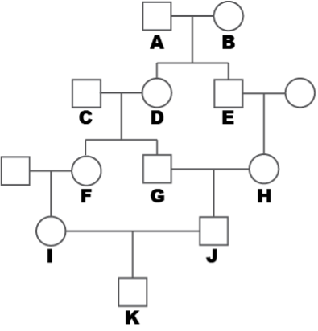

<style type="text/css">

body, td {
   font-size: 14px;
}
code.r{
  font-size: 12px;
}
pre {
  font-size: 12px
}
</style>
```{r setup, include=FALSE}
knitr::opts_chunk$set(echo = TRUE)
knitr::opts_knit$set(root.dir = "/Users/fs61oo/Documents/GitHub/AAU-human-genomics/")
library(ggplot2)
set.seed(666)
```

### Part I
#### Exercise 1
Population geneticists analyze the extent and patterns of genetic variation within populations, the distribution of genotypes, and the influence of evolutionary forces like natural selection and genetic drift. These factors drive evolutionary change and speciation. Based on your current understanding, how would you address the following questions?

1.  How can we measure genetic variation within a population?
2.  How can we determine whether a population’s genetic structure is changing over time?
<br />
<br />

#### Exercise 2
Which term refers to the complete set of genetic information shared by all individuals within a population?

1.  Gene pool
2.  Genome
3.  Chromosome complement
4.  Breeding unit
5.  Race

Various mechanisms help preserve genetic diversity within a population. Why is maintaining this diversity beneficial?

1.  Homozygosity provides an evolutionary advantage.
2.  Increased diversity promotes inbreeding benefits.
3.  Genetic diversity enhances a population’s ability to adapt to environmental changes.
4.  Greater genetic diversity increases the likelihood of haploidy.
5.  Genetic diversity prevents diploidy.
<br />
<br />

#### Exercise 3
Human serum contains a protein called haptoglobin, which binds to hemoglobin following the lysis of erythrocytes. In some populations, three electrophoretic haptoglobin variants are observed, determined by three autosomal co-dominant alleles: A, B, and C. Among 500 individuals, the following genotype counts were recorded:

<style type="text/css">
.tg  {border-collapse:collapse;border-color:#ccc;border-spacing:0;}
.tg td{background-color:#fff;border-color:#ccc;border-style:solid;border-width:1px;color:#333;
  font-family:Arial, sans-serif;font-size:14px;overflow:hidden;padding:10px 5px;word-break:normal;}
.tg th{background-color:#f0f0f0;border-color:#ccc;border-style:solid;border-width:1px;color:#333;
  font-family:Arial, sans-serif;font-size:14px;font-weight:normal;overflow:hidden;padding:10px 5px;word-break:normal;}
.tg .tg-baqh{text-align:center;vertical-align:top}
.tg .tg-amwm{font-weight:bold;text-align:center;vertical-align:top}
.tg .tg-0lax{text-align:left;vertical-align:top}
</style>
<table class="tg"><thead>
  <tr>
    <th class="tg-amwm" colspan="6">No individuals</th>
    <th class="tg-amwm">Total</th>
  </tr></thead>
<tbody>
  <tr>
    <td class="tg-baqh">AA</td>
    <td class="tg-baqh">AB</td>
    <td class="tg-baqh">AC</td>
    <td class="tg-baqh">BB</td>
    <td class="tg-baqh">BC</td>
    <td class="tg-baqh">CC</td>
    <td class="tg-0lax"></td>
  </tr>
  <tr>
    <td class="tg-baqh">109</td>
    <td class="tg-baqh">123</td>
    <td class="tg-baqh">128</td>
    <td class="tg-baqh">33</td>
    <td class="tg-baqh">70</td>
    <td class="tg-baqh">37</td>
    <td class="tg-baqh">500</td>
  </tr>
</tbody>
</table>
<br />

1.  Compute the genotype frequencies within the sample.
2. Compute the allele frequency within the sample.
<br />
<br />

#### Exercise 4
Cystic fibrosis (CF) is an autosomal recessive disease. In individuals who are homozygous for the recessive allele, a malfunction in salt transport occurs in certain cell types, such as those in the lungs. This defect leads to thick mucus buildup, increasing the risk of bacterial lung infections.

Historically, only a small number of individuals with CF survived into adulthood. In Europe, the birth prevalence of CF has been approximately 1 in 2,500 newborns. This frequency is maintained by a balance between mutation and natural selection.

In a European sample, cystic fibrosis (CF) carrier status was analyzed based on three genotypes: 16,890 individuals were homozygous for the normal allele (<tt>RR</tt>), 855 individuals were heterozygous carriers (<tt>Rr</tt>), and 18 individuals were homozygous for the recessive CF allele (<tt>rr</tt>).

1.  Calculate the frequency of each allele in the sample.
<br />
<br />

#### Exercise 5
A geneticist studying a human population discovers that a recessive allele (<tt>s</tt>) associated with sickle cell disease is present in a community of 1,024 individuals. Individuals carrying two copies of the recessive allele (<tt>ss</tt>) develop sickle cell disease, while those with at least one dominant allele (<tt>S</tt>) have normal red blood cells. Within the population, 1 in 256 individuals has sickle cell disease, indicating they are homozygous recessive (<tt>ss</tt>).

1.	Assuming random mating and no selection for this gene, how many individuals with normal red blood cells are carriers of the recessive allele?
<br />
<br />

#### Exercise 6 
This exercise should be solved using <tt>R</tt>.

Run every step in the code below, and explain what each step does. 
```{r, eval=F}
# define alleles
  A1 <- "A"
  A2 <- "a"

# define frequency of A1
  p <- 0.2
  allele <- c(rep(A1,p*10),rep(A2,(1-p)*10))

# define population size
  N <- 100

# define population
  pop <- matrix(nrow=N, ncol=2)
  
  for(i in 1:nrow(pop)){
    pop[i, 1] <- sample(allele, 1)
    pop[i, 2] <- sample(allele, 1)
  }

# combine alleles into genotype
  pop <- cbind(pop, paste(pop[,1],pop[,2],sep=""))
```
<br />

We can count how many we have of each genotype using the `table(snp)` function.

1.  Determine the genotype and allele frequency. 
2.  Make sure you understand every step.

```{r, eval=F}
# genotype count
  obs.count <- table(pop[,3])

# combine the two heterozygote genotypes (Aa and aA is the same)
  pop[,3][pop[,3]=="aA"] <- "Aa"
  obs.count <- table(pop[,3])

# total number of observations
  Nobs <- sum(obs.count)

# genotype frequencies
  geno.freq <- obs.count / Nobs

# allele frequencies
  p.A <- (2*obs.count["AA"] + obs.count["Aa"]) / (2*Nobs)
  p.a <- (2*obs.count["aa"] + obs.count["Aa"]) / (2*Nobs)
```
<br />

3.  Does it match the expectation based on how you simulated the genotypes? 
4.  We can redo the simulations a number of times, and with different population sizes.
```{r, eval=F}
# set global parameters
  N <- seq(10,1000,10)
  rep <- 10
  A1 <- "A"
  A2 <- "a"
  p <- 0.2
  allele <- c(rep(A1,p*10),rep(A2,(1-p)*10))

  p.A <- matrix(nrow=rep, ncol=length(N))  
  colnames(p.A) <- N
  rownames(p.A) <- paste("rep",1:rep,sep="")
  
# run simulations
  for(i in 1:length(N)){
    for(j in 1:rep){
      pop <- matrix(nrow=N[i], ncol=2)  
      
      for(k in 1:nrow(pop)){
        pop[k, 1] <- sample(allele, 1)
        pop[k, 2] <- sample(allele, 1)
      }
    pop <- cbind(pop, paste(pop[,1],pop[,2],sep=""))
    pop[,3][pop[,3]=="aA"] <- "Aa"
    
    obs.count <- table(pop[,3])
    Nobs <- sum(obs.count)
    geno.freq <- obs.count / Nobs
    p.A[j,i] <- (2*obs.count["AA"] + obs.count["Aa"]) / (2*Nobs)
    }
  }

```

5.  Why does the matrix `p.A` contains many values that are `NA` ?
6.  Visualise the results from these simulations. What do you see?
```{r, eval=F}
library(ggplot2)
library(reshape2)
p.A <- melt(p.A)
ggplot(p.A[!is.na(p.A$value),], aes(x = Var2, y = value, fill = factor(Var2))) +
  geom_hline(yintercept = p, linetype = "dashed", color = "darkorange", linewidth = 0.75) +
  geom_boxplot(alpha = 0.6) + 
   coord_cartesian(ylim = c(0.1, 0.35)) +
  labs(x = "N", y = "p(A)", title = "") +
  theme_classic() + theme(legend.position = "none") 
```
<br />
<br />

#### Exercise 7
In the second part of these exercises, we will examine deviations from expected genotype frequencies. According to the Hardy-Weinberg principle, genotype frequencies can be predicted from allele frequencies under certain assumptions. Specifically, if allele A has a frequency of p and allele a has a frequency of q, the expected genotype frequencies are:

-  <tt>AA</tt> $p^2$
-  <tt>Aa</tt> $2pq$
-  <tt>aa</tt> $q^2$

Next, we will create a figure that visualizes the predicted genotype frequencies for different values of p. Take the time to review and understand the code used to generate it.
```{r, fig.align='center',fig.width=5,fig.height=4}
curve(2*x*(1-x),col="darkblue", ylim=c(0,1), lwd=2, xlab="Allele frequency", ylab="Genotype frequency", las=1)
  text(x=0.5, y=0.7, labels="Aa", col="darkblue", font=2)
curve(x**2,col="darkgreen", add=T, ylab="NULL", ylim=c(0,1), lwd=2)
  text(x=0.9, y=0.7, labels="AA", col="darkgreen", font=2)
curve((1-x)**2,col="darkred",add=T, ylab="NULL", ylim=c(0,1),lwd=2)
  text(x=0.1, y=0.7, labels="aa", col="darkred", font=2)
```
<br />
<br />

### Part II

#### Exercise 8
In a study of 10,000 individuals of Danish ancestry, researchers analyzed two genetic loci, including the _CFTR_ gene (associated with cystic fibrosis) and the <tt>APOE</tt> gene (linked to Alzheimer’s disease risk). These loci were chosen due to their well-established roles in disease susceptibility and health outcomes, providing insights into the genetic factors influencing these conditions in the population.

<style type="text/css">
.tg  {border-collapse:collapse;border-spacing:0;}
.tg td{border-color:black;border-style:solid;border-width:1px;font-family:Arial, sans-serif;font-size:14px;
  overflow:hidden;padding:10px 5px;word-break:normal;}
.tg th{border-color:black;border-style:solid;border-width:1px;font-family:Arial, sans-serif;font-size:14px;
  font-weight:normal;overflow:hidden;padding:10px 5px;word-break:normal;}
.tg .tg-c3ow{border-color:inherit;text-align:center;vertical-align:top}
.tg .tg-0pky{border-color:inherit;text-align:left;vertical-align:top}
</style>
<table class="tg"><thead>
  <tr>
    <th class="tg-c3ow" colspan="3"><span style="font-weight:bold;font-style:italic">CFTR</span></th>
    <th class="tg-0pky"></th>
    <th class="tg-c3ow" colspan="3"><span style="font-weight:bold;font-style:italic">APO</span><span style="font-weight:bold">E</span></th>
  </tr></thead>
<tbody>
  <tr>
    <td class="tg-c3ow">WT | WT</td>
    <td class="tg-c3ow">WT | F508del<br></td>
    <td class="tg-c3ow">F508del | F508del</td>
    <td class="tg-c3ow"></td>
    <td class="tg-c3ow">ε3 | ε3</td>
    <td class="tg-c3ow">ε3 | ε4</td>
    <td class="tg-c3ow">ε4 | ε4</td>
  </tr>
  <tr>
    <td class="tg-c3ow"><span style="color:black">3156</span></td>
    <td class="tg-c3ow"><span style="color:black">4997</span></td>
    <td class="tg-c3ow"><span style="color:black">1847</span></td>
    <td class="tg-c3ow"></td>
    <td class="tg-c3ow"><span style="color:black">6837</span></td>
    <td class="tg-c3ow"><span style="color:black">3065</span></td>
    <td class="tg-c3ow"><span style="color:black">98</span></td>
  </tr>
</tbody></table>
<br />
<br />

1.  Compute the allele- and genotype frequencies for the two alleles in both the _CFTR_- and _APOE_-locus.
2.  Perform the necessary calculations to determine whether the allele frequencies at the two loci follow Hardy-Weinberg equilibrium proportions.
<br />
<br />

#### Exercise 9

Cystic fibrosis (CF) is an autosomal, recessive disease. Homozygotes individuals (<tt>F508del|F508del</tt>) have reduced function of the salt transporters in some cell types, including the lungs. This entails mucus in the airways which increases the risk of bacterial infections.

Until recently, only few individuals survived to adulthood. In Europe, the frequency of newborns with CF has historical been 1:2500. This rate is maintained by a balance between selection ($s$) and mutation (&mu;).

In a study blood samples were collected to determine the genotype frequency of a certain CF mutation. The disease-causing allele is called <tt>F508del</tt>, while the non-disease-causing allele is called <tt>WT</tt>. The genotypes of the enrolled participants are shown in the table below.

<style type="text/css">
.tg  {border-collapse:collapse;border-color:#ccc;border-spacing:0;}
.tg td{background-color:#fff;border-color:#ccc;border-style:solid;border-width:1px;color:#333;
  font-family:Arial, sans-serif;font-size:14px;overflow:hidden;padding:10px 5px;word-break:normal;}
.tg th{background-color:#f0f0f0;border-color:#ccc;border-style:solid;border-width:1px;color:#333;
  font-family:Arial, sans-serif;font-size:14px;font-weight:normal;overflow:hidden;padding:10px 5px;word-break:normal;}
.tg .tg-baqh{text-align:center;vertical-align:top}
.tg .tg-c3ow{border-color:inherit;text-align:center;vertical-align:top}
</style>
<table class="tg"><thead>
  <tr>
    <th class="tg-c3ow" colspan="3"><span style="font-weight:bold;font-style:italic">CFTR</span></th>
  </tr></thead>
<tbody>
  <tr>
    <td class="tg-c3ow">WT | WT</td>
    <td class="tg-c3ow">WT | F508del<br></td>
    <td class="tg-c3ow">F508del | F508del</td>
  </tr>
  <tr>
    <td class="tg-baqh">16890</td>
    <td class="tg-baqh">855</td>
    <td class="tg-baqh">18</td>
  </tr>
</tbody>
</table>

1.  Compute the allele frequency in the sample.
2.  How many individuals do you expect to be born with each genotype if the sample is in Hardy-Weinberg proportions?
3.  Is the sample in Hardy-Weinberg proportions?
4.  Compute what the mutation rate (&mu;) must be, when there in the population through many generations has been maintained a frequency of 1:2500 among newborns and when the fitness ($w=1-s$) of CF-individuals is 0%.
5.  Assume that a new medical treatment for CF has been developed such that patients with CF live longer and many of the CF-carriers also get children. This entails that the fitness of individuals with CF is changed to 40% compared to persons without CF. At equilibrium, what will the new frequency be of the CF-allele <tt>F508del</tt>, and what will the frequency be of newborns with CF?
<br />
<br />

#### Exercise 10 

Out of 2,400 births at a UK hospital, 6 newborn deaths were recorded, all of which were attributed to a colon defect caused by a recessive lethal allele (<tt>co</tt>) that follows an autosomal inheritance pattern. Assuming Hardy-Weinberg equilibrium, answer the following:

1.  What is the frequency of the co allele in the newborn population?

2.  What is the frequency of heterozygous carriers in both newborns and adults?
<br />
<br />


#### Exercise 11

Red-green colour blindness is caused by a recessive, X-linked gene (<tt>f</tt>). In a large population, the frequency of the <tt>f</tt> allele is denoted as $q$ in both males and females. Assuming random mating and no selection, answer the following:

1.  What is the expected frequency of colour-blind females in the population?
2.  What is the expected frequency of marriages between a colour-blind male and a non-colour-blind female?
3.  What is the expected frequency of colour-blind boys born from a colour-blind father and a non-colour-blind mother?
<br />
<br />

#### Exercise 12
Now we will use R to test for Hardy-Weinberg proportion. Run every step in the code below, and explain what each step does.

First we define variables.
```{r, eval=F}
# define genotype counts
  AA <- 375
  Aa <- 165
  aa <- 32
  
# find the total number of individuals
  n <- AA+Aa+aa
```

We can calculate the allele frequencies from the observed genotype counts.
```{r, eval=F}
p <- (2*AA + Aa) / (2*n)
q <- c(2*aa + Aa) / (2*n)

# check that we have counted all alleles
p+q == 1
```

Using the allele frequencies we can compute the expected genotype frequencies if the population is in Hardy-Weinberg equlibrium.
```{r, eval=F}
# calculating expected values  
  E.AA <- n*p**2
  E.Aa <- n*2*p*q
  E.aa <- n*q**2

# check that we have counted all individuals
  E.AA + E.Aa + E.aa == n
```

We can do a formal statistical test for whether the number of genotypes we observe matches our expectations. This is done using a $\chi^2$-test which is defined as:
$$\chi^2 = \sum_{i=1}^{geno} = \frac{(E - O)^2}{E}$$
where $E$ is the expected number of counts, and O is the observed number of counts, which is summed across all genotype categories ($geno$).

The $\chi^2$-statistican can be calculated as:
```{r, eval=F}
# compute chi-square test-statistic
  chi2 <- (E.AA-AA)^2/E.AA + (E.Aa-Aa)^2/E.Aa + (E.aa-aa)^2/E.aa
```


Next we have to determine whether the $\chi^2$-statistic is larger than expected.  To compute the probability value (i.e., _P_-value) from a $\chi^2$-distribution we can use the function `pchisq()` with the argument `lower.tail=FALSE` because we to see the probability that the $\chi^2$ value being higher than it is. To have an appropriate distribution, we need to add how many degrees of freedom (df) to consider, $df=\frac{n(n1)}{n}$, where $n=\textrm{no. alleles}$. Thus, in our example, $df=\frac{2(2-1)}{2}=1$.
```{r, eval=F}
# obtain P-value
  pval <-pchisq(chi2, df=1, lower.tail=FALSE)
```
```{r, eval=T,echo=F}
chi2 <- 5.622959
pval <- 0.01772669
geno <- c(375, 165, 32)
expe <- c(365.92, 183.16, 22.92002)
dat <- matrix(c(geno,expe),nrow=2, byrow=T)
```

Therefore, the _P_-value is `r round(pval,3)`, indicating that at a 5% significance level, our sample does not support the Hardy-Weinberg equilibrium. The figure below shows the $\chi^2$-distribution with $df=1$ where the vertical line shows the $\chi^2$-value from our analysis.

```{r, echo=F, fig.align='center', fig.width=5,fig.height=4}
x <- seq(0, 10, 0.1)
y <- dchisq(x, df = 1)
df <- data.frame(x = x, y = y)
ggplot(data = df, aes(x = x, y = y)) +
  geom_line(color = "darkblue", linewidth = .75) +
  geom_vline(xintercept = chi2, linewidth = .75, color = "darkorange", linetype = "dashed") + 
  labs(y = "Density Function",
       x = expression(chi^2)) + 
  theme_minimal()
```

We can visualise the observed and expected genotype counts to get an idea of why the sample is not in Hardy-Weinberg. 

```{r, eval=F}
geno <- c(AA, Aa, aa)
expe <- c(E.AA, E.Aa, E.aa)
dat <- matrix(c(geno,expe),nrow=2, byrow=T)
```

```{r, fig.align='center', fig.height=4,fig.width=4}
barplot(dat, beside=T, col=c("#6D8325FF", "#BD5630FF"), names.arg=c("AA","Aa","aa"), las=1, cex.axis=.8, xlab="Genotype", ylab="Genotype counts")
legend("topright",legend=c("Observed", "Expected"),pch=15, col=c("#6D8325FF", "#BD5630FF"), cex=.8)
```

1.  What possible explanations can you provide for why this sample does not follow Hardy-Weinberg equilibrium?

<br />
<br />

### Part III

#### Exercise 13
1.  Given a population with an average inbreeding coefficient ($F$) and allele frequencies $p$ (for allele <tt>A</tt>) and $q$ (for allele <tt>a</tt>), what are the expected genotype frequencies at this locus? Additionally, how does inbreeding influence both allele frequencies and genotype frequencies?
2.  Compute the inbreeding coefficient for individual <tt>K</tt> in the pedigree below.
3.	It turns out that individual <tt>C</tt> in the pedigree above is the offspring of a cousin marriage. Redraw the pedigree focusing on individual <tt>C</tt>, and use this updated information to calculate the inbreeding coefficient ($F$) for individual <tt>K</tt>.
<br />
  
<p align="center">

</p>
<br />
<br />

#### Exercise 14
The ability to taste the bitter compound phenylthiocarbamide (PTC) is controlled by a dominant allele (<tt>T</tt>), meaning individuals with at least one <tt>T</tt> allele can perceive its bitterness, while <tt>t</tt> homozygotes cannot. PTC tasting is linked to variation in the _TAS2R38_ gene, which encodes a bitter taste receptor on the tongue.

PTC itself is not found in foods but is chemically similar to naturally occurring bitter compounds in certain vegetables, such as broccoli, Brussels sprouts, kale, and cabbage. The ability to taste these compounds may have evolutionary significance, as it could help individuals avoid toxic plants that contain bitter-tasting alkaloids.

1.  In a study of 100 students, 62 individuals had the <tt>TT</tt> genotype (strong tasters), 32 had the <tt>Tt</tt> genotype (moderate tasters), and 6 had the <tt>tt</tt> genotype (non-tasters). Calculate the allele frequencies of <tt>T</tt> and <tt>t</tt> in this population.
2. Using the observed genotype frequencies, assess whether the population is in Hardy-Weinberg equilibrium by comparing expected and observed proportions.
<br />
<br />

#### Exercise 15
In this <tt>R</tt>-exercise, we will investigate, how population size influence the fixation and extinction probabilities of individual alleles.

The function`sim` allow you to simulate `num_populations` with a population size given by `pop_size` (which can vary between the different populations) for `generations`. The starting allele frequency can be specified for each simulated population with `allele_freqs`.

```{r}
# Function to simulate allele frequency across generations for multiple populations
sim <- function(pop_size, generations, num_populations = 1, allele_freqs = 0.5) {
  
  # Create a list to store allele frequencies for each population
  freq_matrix_list <- vector("list", num_populations)
  
  # Run the simulations
  for (p in 1:num_populations) {
    allele_freq <- allele_freqs[p]
    freq_matrix <- matrix(NA, nrow = generations, ncol = 1)
    current_freq <- allele_freq
    freq_matrix[1, 1] <- current_freq  # Store the initial allele frequency
      
    for (gen in 2:generations) {
      # Simulate the allele frequency for the next generation using binomial sampling
      a <- rbinom(1, 2*pop_size, current_freq) 
      current_freq <- a/(2*pop_size)
      freq_matrix[gen, 1] <- current_freq
    }
    
    freq_matrix_list[[p]] <- freq_matrix
  }
  
  return(freq_matrix_list)
}
```

The function below allow us to run several simulations and collect the results.
```{r}
  run_sim <- function(population_sizes=NULL, generations=NULL, num_populations=NULL, initial_allele_freqs=NULL){
    # Store the results in a data frame
    results <- data.frame()

    # Run the simulation for different population sizes
    for (pop_size in population_sizes) {
      freq_matrix_list <- sim(pop_size,generations,num_populations,allele_freqs = initial_allele_freqs)
  
      # Prepare the data for plotting
      for (p in 1:num_populations) {
        freq_matrix <- freq_matrix_list[[p]]
        temp_df <- data.frame(
          generation = rep(1:generations),
          freq = as.vector(freq_matrix),
          population_size = rep(pop_size, generations),
          population_num = rep(p, generations))
      results <- rbind(results, temp_df)
      }
    }
    
  return(results)
  }
```
<br />
<br />

In the first example, we simulate 10 different populations, each consisting of 100 individuals, with an initial allele frequency of 0.5. We will run the simulation for 100 generations.
```{r}
# Parameters
  population_sizes <- 100
  generations <- 100
  num_populations <- 3
  initial_allele_freqs <- rep(0.5,num_populations)

  sim.res <- run_sim(population_sizes=population_sizes, 
                     generations=generations, 
                     num_populations=num_populations, 
                     initial_allele_freqs=initial_allele_freqs)

# Count how many populations that has been fixed  
  sim.res$fixed <- paste(sim.res$population_size,":",sim.res$population_num,sep="")
  is.fixed <- NULL
  for(pop in unique(sim.res$fixed)){
    is.fixed <- c(is.fixed, any(sim.res[sim.res$fixed==pop,]$freq==0 | sim.res[sim.res$fixed==pop,]$freq==1))
  }
```
<br />
<br />
```{r, fig.align='center', fig.height=4,fig.width=5}
  ggplot(sim.res, aes(x = generation, y = freq, 
                      group = interaction(population_size, population_num), 
                      color = as.factor(fixed))) +
    geom_line(alpha = 0.7) +
    labs(title = paste("Number of populations fixed:", sum(is.fixed)),
       x = "Generation",
       y = "Allele Frequency",
       color = "Population Number") +
    scale_y_continuous(limits = c(0, 1)) +
    theme_minimal() +
    theme(legend.position = "bottom") 

```
<br />
<br />

1.  With you own words, describe what is happening in the figure above.
2.  In the next simulation, change `population_sizes <- c(10,50,100)`. How does that affect the results?
3.  How does varying the `initial_allele_freqs` affect the probability of fixation?


**Allow migration**
A fraction (migration_rate) of individuals in the population is replaced by migrants from an external source population.
The new allele frequency after migration is:

$$p{\prime} = (1 - m) p + m P_m$$

-  $m$  = migration_rate (proportion of migrants each generation),
-  $p$  = current allele frequency in the population,
-  $P_m$  = migrant_freq (allele frequency of migrants).

**Allow mutations**
The allele frequency update follows:

$$p{\prime} = (1 - \mu) p + \mu (1 - p)$$
	
-  $p$  = current allele frequency,
-  $\mu$  = mutation rate.

```{r, eval=F}
#mu: Mutation rate (default = 0, meaning no mutation).
#	Mutations allow alleles to change from one type to another, preventing complete fixation.
#mu = 0.001 means a mutation rate of 0.1% per generation.


# Function to simulate allele frequency changes with drift, migration, and mutation
sim <- function(pop_size, generations, num_populations = 1, allele_freqs = 0.5, 
                migration_rate = 0, migrant_freq = 0.5, mu = 0) {
  
  # Create a list to store allele frequencies for each population
  freq_matrix_list <- vector("list", num_populations)
  
  # Run the simulations
  for (p in 1:num_populations) {
    allele_freq <- allele_freqs[p]
    freq_matrix <- matrix(NA, nrow = generations, ncol = 1)
    current_freq <- allele_freq
    freq_matrix[1, 1] <- current_freq  # Store the initial allele frequency
    
    for (gen in 2:generations) {
      # Step 1: Genetic Drift (Binomial Sampling)
      a <- rbinom(1, 2 * pop_size, current_freq) 
      current_freq <- a / (2 * pop_size)
      
      # Step 2: Migration Effect
      if (migration_rate > 0) {
        current_freq <- (1 - migration_rate) * current_freq + migration_rate * migrant_freq
      }
      
      # Step 3: Mutation Effect
      if (mu > 0) {
        current_freq <- (1 - mu) * current_freq + mu * (1 - current_freq)
      }
      
      freq_matrix[gen, 1] <- current_freq
    }
    
    freq_matrix_list[[p]] <- freq_matrix
  }
  
  return(freq_matrix_list)
}
```

```{r, eval=F}
# Simulation with Drift + Migration + Mutation
sim(pop_size = 100, generations = 50, num_populations = 3, allele_freqs = c(0.4, 0.6, 0.8), 
    migration_rate = 0.05, migrant_freq = 0.7, mu = 0.001)
```

```{r, eval=F}
# Simulation with Only Drift and Mutation (No Migration)
sim(pop_size = 100, generations = 50, num_populations = 3, allele_freqs = c(0.4, 0.6, 0.8), 
    migration_rate = 0, mu = 0.005)
```

<br />
<br />

