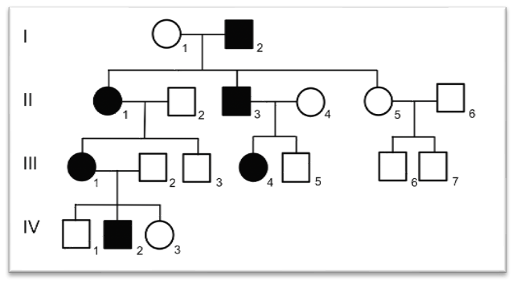
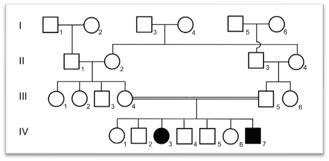
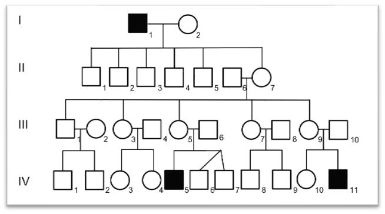
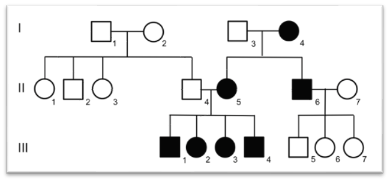
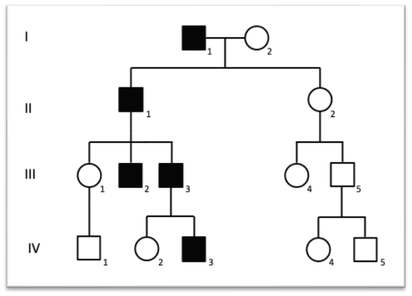
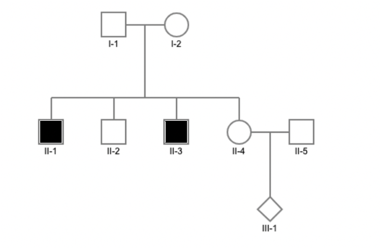
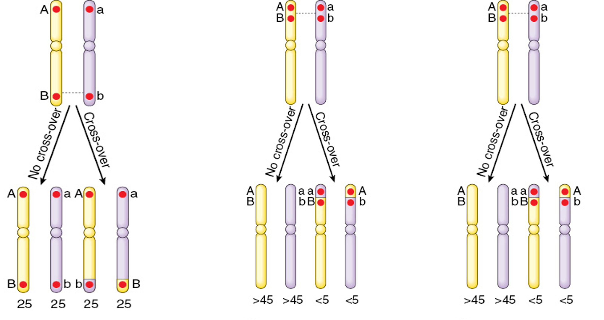
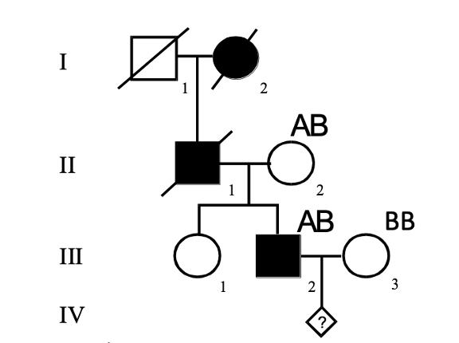
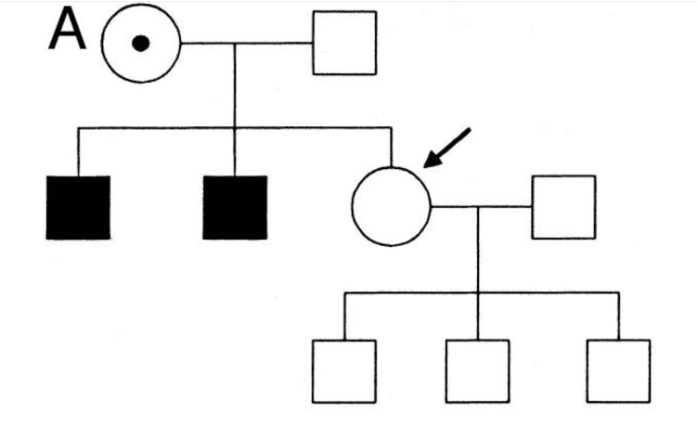

<style type="text/css">

body, td {
   font-size: 14px;
}
code.r{
  font-size: 12px;
}
pre {
  font-size: 12px
}
</style>
```{r setup, include=FALSE}
knitr::opts_chunk$set(echo = TRUE)
knitr::opts_knit$set(root.dir = "/Users/fs61oo/Documents/GitHub/AAU-human-genomics/")
library(ggplot2)
library(patchwork)
set.seed(666)
```

#### Exercise 1
For each pedigree, determine the most probable inheritance pattern, assuming monogenic inheritance and full penetrance.

**Pedigree 1** <br />
<p align="center">

</p>
<br />
<br />
**Pedigree 2** <br />
<p align="center">

</p>
<br />
<br />
**Pedigree 3** <br />
<p align="center">

</p>
<br />
<br />
**Pedigree 4** <br />
<p align="center">

</p>
<br />
<br />
**Pedigree 5** <br />
<p align="center">

</p>
<br />
<br />

#### Exercise 2
A 25-year-old healthy woman seeks genetic counseling for a hereditary skin condition, ichthyosis, which is present in her family. Ichthyosis is characterized by dry, thickened, “fish-scale” skin.

-  The woman has a younger brother and sister, both unaffected.
-  Her father has ichthyosis.
-  The father’s older brother is also affected, while their two older sisters are healthy.
-  The father’s affected brother has three healthy children: a 26-year-old son and two 22-year-old monozygotic twin daughters.
-  The woman’s mother has a younger brother with intellectual disability but no skin disease.
-  The woman’s maternal and paternal grandparents are deceased and were unaffected. However, the paternal grandmother had a brother with ichthyosis.

1.	Draw the pedigree for this family.
2.	What is the most likely mode of inheritance for this disease? Justify your answer.
3.	The woman begins a relationship with her father’s brother’s son. If they have children, what is the probability that their child will inherit ichthyosis? (Hint: Use a Punnett square to determine the risk.)

<br />
<br />

#### Exercise 3

In the pedigree below, filled symbols represent individuals affected by chronic granulomatous disease.

<p align="center">

</p>


A.  Assuming the disease is X-linked recessive: 
    1.  Which individuals are obligate carriers of the disease-causing allele? 
    2.  How should obligate carriers be indicated in the pedigree?
    3.  What is the probability that individual II-4 is a carrier of the disease-causing allele?
    4.  What is the probability that individual III-1 will develop the disease?

B.  Assuming the disease is autosomal recessive, and individual II-5 is not a carrier: 
    1.  Which individuals are obligate carriers of the disease allele? 
    2.  What is the probability that individual II-4 is a carrier?
    3.  What is the probability that individual III-1 has inherited the disease-causing allele?

C.  Assuming the disease is autosomal recessive, with a population disease frequency of 4 in 10,000:
    1.  What is the probability that individual II-5 is a carrier?
    2.  If you take the above risk into consideration, what is then the risk that III-1 will get the disease?
    
<br />
<br />

#### Exercise 4

What is the genetic distance between locus $A$ and $B$ in the three examples below?

<p align="center">

</p>

<br />
<br />

#### Exercise 5
The two genetic marker loci, $A$ and $B$, are located on chromosome 9, with a genetic distance of 15 cM between them.

-  Marker locus A has two alleles, $A_1$ and $A_2$
-  Marker locus B has two alleles, $B_1$ and $B_2$

The father is heterozygous at both loci, carrying the haplotypes $A_1B_1$ and $A_2B_2$. The figure below illustrates chromosome 9, depicting both loci and their respective alleles.

<p align="center">

</p>

1.  Draw a similar chromosome set and position the father’s alleles.
2.  Describe the different gametes that the father can produce and account for the frequencies of these gametes.

<br />
<br />


#### Exercise 6
A monogenic hereditary disease is present in the pedigree shown below. A marker locus located in the first intron of the disease gene has two alleles, A and B. The genotypes for this marker locus are provided for individuals II-2, III-2, and III-3 in the pedigree.

<p align="center">

</p>

A. Based on the available genotype data, can we determine which marker allele (A or B) is located at 0 cM distance to the disease allele? Justify your answer.
B. If we assume that II-1 has the genotype BB, does this allow us to conclusively determine which marker allele is linked to the disease allele?
C. If the fetus IV-1 has inherited the disease allele, what genotype is expected at the marker locus?

<br />
<br />

#### Exercise 7
Assume an X-linked recessive monogenic disorder with full penetrance. 

1.  Based on all the information in the pedigree below, what is the probability that II.3 is a carrier of the monogenic disease-causing allele? (Hint: Use Bayes theorem)

<p align="center">

</p>

<br />
<br />


#### Exercise 8

Among Danish women with breast cancer, 3% carry a pathogenic variant. Sanger sequencing detects pathogenic variants in _BRCA1_ and _BRCA2_ with 80% sensitivity.

Lise, who is of Danish descent, underwent Sanger sequencing for _BRCA1_ and _BRCA2_, and no pathogenic variant was detected.

1.  What is the probability that Lise is still a carrier of a pathogenic variant in _BRCA1_ and _BRCA2_ despite the negative test result?

<br />
<br />
