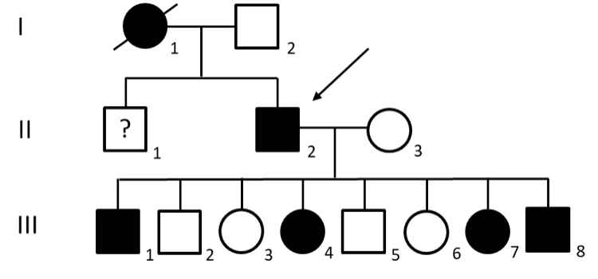
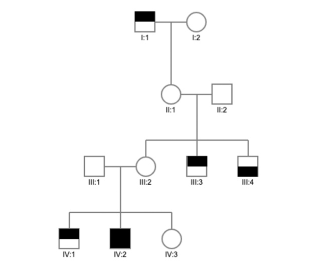

<style type="text/css">

body, td {
   font-size: 14px;
}
code.r{
  font-size: 12px;
}
pre {
  font-size: 12px
}
</style>
```{r setup, include=FALSE}
knitr::opts_chunk$set(echo = TRUE)
knitr::opts_knit$set(root.dir = "/Users/fs61oo/Documents/GitHub/AAU-human-genomics/")
library(ggplot2)
library(patchwork)
set.seed(666)
```

#### Exercise 1
CPVT is a rare genetic condition that causes life-threatening arrhythmias. It follows an autosomal dominant inheritance pattern and is caused by mutations in the _CALM1_ gene, with at least 76 different mutations identified globally. Individuals carrying a pathogenic mutation are advised to receive an implantable cardioverter-defibrillator.

A.  What type of genetic heterogeneity do we see for CPVT?

The _CALM1_ gene is located on chromosome 14q32. Chromosome 14 is acrocentric.

B.  Draw chromosome 14 in the metaphase and indicate p arm, q arm, centromere, and the approximate location of the CALM1 locus.

Below is the pedigree of Carl’s family, and Carl is indicated by an arrow.
<br />
<br />

<p align="center">

</p>
<br />
<br />

C.  How can you see from the pedigree that CPVT is an autosomal dominant disease?

A marker analysis is performed for the linked marker D19S584 located 0cM from the _CALM1_ gene. The genotypes found in the marker analysis are shown in the table below.

<style type="text/css">
.tg  {border-collapse:collapse;border-color:#ccc;border-spacing:0;}
.tg td{background-color:#fff;border-color:#ccc;border-style:solid;border-width:1px;color:#333;
  font-family:Arial, sans-serif;font-size:12px;overflow:hidden;padding:10px 5px;word-break:normal;}
.tg th{background-color:#f0f0f0;border-color:#ccc;border-style:solid;border-width:1px;color:#333;
  font-family:Arial, sans-serif;font-size:12px;font-weight:normal;overflow:hidden;padding:10px 5px;word-break:normal;}
.tg .tg-0lax{text-align:left;vertical-align:top}
</style>
<table class="tg" style="undefined;table-layout: fixed; width: 502px"><colgroup>
<col style="width: 70px">
<col style="width: 36px">
<col style="width: 36px">
<col style="width: 36px">
<col style="width: 36px">
<col style="width: 36px">
<col style="width: 36px">
<col style="width: 36px">
<col style="width: 36px">
<col style="width: 36px">
<col style="width: 36px">
<col style="width: 36px">
<col style="width: 36px">
</colgroup>
<thead>
  <tr>
    <th class="tg-0lax">Individual</th>
    <th class="tg-0lax">I-1</th>
    <th class="tg-0lax">I-2</th>
    <th class="tg-0lax">II-2</th>
    <th class="tg-0lax">II-3</th>
    <th class="tg-0lax">III-1</th>
    <th class="tg-0lax">III-2</th>
    <th class="tg-0lax">III-3</th>
    <th class="tg-0lax">III-4</th>
    <th class="tg-0lax">III-5</th>
    <th class="tg-0lax">III-6</th>
    <th class="tg-0lax">III-7</th>
    <th class="tg-0lax">III-8</th>
  </tr></thead>
<tbody>
  <tr>
    <td class="tg-0lax">D19S584</td>
    <td class="tg-0lax">1,1</td>
    <td class="tg-0lax">1,2</td>
    <td class="tg-0lax">1,2</td>
    <td class="tg-0lax">1,3</td>
    <td class="tg-0lax">1,3</td>
    <td class="tg-0lax">1,2</td>
    <td class="tg-0lax">2,3</td>
    <td class="tg-0lax">1,1</td>
    <td class="tg-0lax">1,2</td>
    <td class="tg-0lax">2,3</td>
    <td class="tg-0lax">1,1</td>
    <td class="tg-0lax">1,3</td>
  </tr>
</tbody></table>
<br />
<br />


D.  What is the disease-linked allele in this family?
E.  Why does Carl’s father not have CPVT despite having the exact same genotype for the linked marker as Carl? 

II-I was given up for adoption and now lives in Spain. The family has no contact with him. His phenotype is unknown.

F.  Without knowing his genotype, what is the risk that Carl’s brother (II-1) has the disease allele? 
G. If Carl’s brother’s genotype is 1,1 do we then know for sure if he has inherited the disease? 

<br />
<br />

#### Exercise 2

In the pedigree below people suffering from ichtyosis are illustrated by filled upper square, and persons suffering from ocular albinism are illustrated by filled lower square. The disorders are both rare with monogenic inheritance. The two disease loci are linked and the distance between the two loci can be set to 15cM. The possible occurrence of new mutations can be disregarded.

<p align="center">

</p>

A.  What mode of inheritance explains the pedigree better? Why?
B.  Draw the pedigree (large pedigree) including all relevant chromosomes and indicate the possible haplotypes for all the individuals in generation III and IV.
C.  Which of the individuals in generation III and IV can with certainty be identified as recombinants and which can with certainty be identified as non-recombinants?


<br />
<br />
<br />
<br />